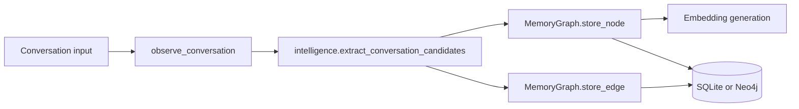
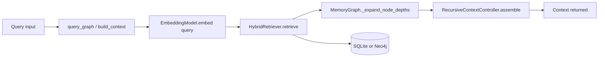
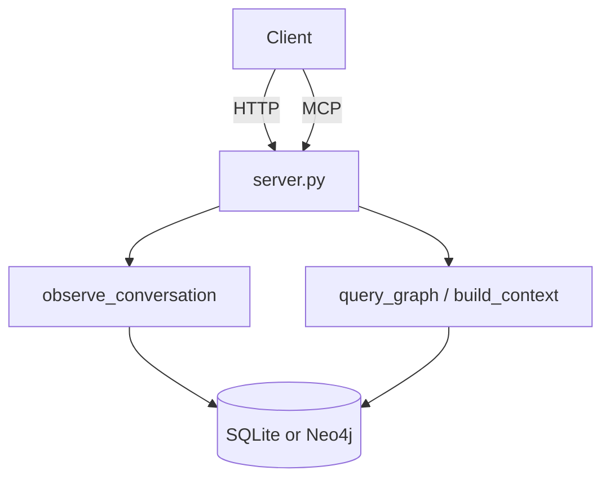

# Contributing to Waggle-MCP

Thank you for your interest in improving Waggle. This document covers everything you need to get started: environment setup, project architecture, testing, code style, and PR guidelines.

---


## Table of Contents

- [Getting Started](#getting-started)
- [First Contribution Paths](#first-contribution-paths)
- [Project Architecture](#project-architecture)
- [Running Tests](#running-tests)
- [Documentation Link Checks](#documentation-link-checks)
- [Writing Tests](#writing-tests)
- [Code Style](#code-style)
- [Key Concepts](#key-concepts)
- [How to Submit a PR](#how-to-submit-a-pr)
---

## Getting Started

```bash
# 1. Clone and enter the repo
git clone https://github.com/Abhigyan-Shekhar/Waggle-mcp.git
cd Waggle-mcp

# 2. Create a virtual environment (Python 3.11+ required)
python -m venv .venv
source .venv/bin/activate     # macOS/Linux
# .venv\Scripts\activate      # Windows

# 3. Install project + all dev tools (ruff, mypy, pytest)
pip install -e ".[dev]"

# 4. Install pre-commit hooks (recommended)
# One-time setup: wires up the existing .pre-commit-config.yaml so ruff
# check and format run automatically before every commit.
pre-commit install

# 5. Verify the setup
waggle-mcp --help
```

### Before opening an issue

Install Waggle from PyPI first and reproduce the problem with the shipped package:

- PyPI: https://pypi.org/project/waggle-mcp/
- VS Code extension: https://marketplace.visualstudio.com/items?itemName=Abhigyan-Shekhar.waggle-memory

This is the expected baseline for issue creation. It helps contributors and maintainers confirm whether the issue reproduces in the published package and the supported editor integration before debugging source-level changes.

## First Contribution Paths

If you are new to the repo, start here before picking an issue:

- [`docs/repository-map.md`](./docs/repository-map.md) explains the important files and directories.
- [`docs/good-first-issues.md`](./docs/good-first-issues.md) lists intentionally scoped starter tasks.
- [`.github/labels.yml`](./.github/labels.yml) defines the label set maintainers should use for triage.

### Before you edit code

Read the matching section in [`docs/repository-map.md`](./docs/repository-map.md) first. That doc now tells you:

- which files implement each feature
- which files are usually safe for newcomers
- which files have a high blast radius
- which files should generally not be touched unless your issue is specifically there

If you skip that step, the most common failure mode is editing an integration file when the real fix belongs in a lower-level module or in docs/tests.

The same document also defines the root layout policy. As a rule, do not add new top-level files unless packaging, deployment tooling, or an external registry requires that exact root path.

### Labeling guidance

#### Maintainer Triage Checklist

When reviewing a new issue:

- Start with `needs-triage` until scope and priority are confirmed.
- Use `good first issue` for small, well-scoped tasks with clear acceptance criteria and a limited blast radius.
- Use `help wanted` for larger tasks that are suitable for external contributors but may require more project context.
- Use `blocked` when progress depends on an external decision, dependency, or unresolved prerequisite.

Quick checklist:

- [ ] Is the issue clearly described?
- [ ] Does it have defined acceptance criteria?
- [ ] Should it be labeled `good first issue` or `help wanted`?
- [ ] Does it need a domain label such as `documentation`, `graph`, `windows`, or `tooling`?
- [ ] Is the issue currently blocked by another task or decision?

- Add one domain label where possible, such as `graph`, `retrieval`, `windows`, `tooling`, or `documentation`.

Repository labels are defined in [`.github/labels.yml`](./.github/labels.yml) and synced with [`scripts/sync_github_labels.py`](./scripts/sync_github_labels.py). Use `--dry-run` first before changing live labels.

To prevent contributor docs from referencing renamed or deleted labels, the repository has an automated drift checker:
```bash
python scripts/check_label_refs.py
```
If you rename or remove a label:
1. Run the script to detect mismatching references in `CONTRIBUTING.md` and `docs/good-first-issues.md`.
2. Update the document references to match the new label names.
3. Commit and push the changes. The check runs automatically on pull requests.

---

## Project Architecture

```text
src/waggle/
├── server.py           — MCP server, CLI entrypoint, all tool definitions
├── graph.py            — Core SQLite-backed graph engine (MemoryGraph)
├── neo4j_graph.py      — Neo4j backend (mirrors graph.py API)
├── models.py           — Pydantic data models (Node, Edge, etc.)
├── config.py           — Environment-driven AppConfig (WAGGLE_* env vars)
├── embeddings.py       — EmbeddingModel: sentence-transformers + deterministic fallback
├── intelligence.py     — NLP heuristics: node extraction, conflict detection, labelling
├── recursive_context.py — build_context / RecursiveContextController
├── abhi.py             — .abhi portable memory format (export, import, diff, merge)
├── retrieval/
│   └── hybrid.py       — Hybrid retrieval: vector + BM25 + graph fusion
├── hooks/
│   └── claude_code/    — Pre/post-response hook scripts for Claude Code
└── static/             — Bundled Graph Studio web UI assets
```

### Key Data Flow

```text
observe_conversation()
    └─► intelligence.extract_conversation_candidates()
    └─► MemoryGraph.store_node() × N           ← SQLite write + embedding
    └─► MemoryGraph.store_edge()  × M           ← auto-inferred edges

query_graph() / build_context()
    └─► EmbeddingModel.embed(query)
    └─► HybridRetriever.retrieve()             ← vector + BM25 + graph
    └─► MemoryGraph._expand_node_depths()      ← graph traversal
    └─► RecursiveContextController.assemble()  ← token-budgeted pack
```


### Observe conversation flow



Note: The runtime instantiates either MemoryGraph (SQLite) or Neo4jMemoryGraph based on config.backend.


### Query graph flow



### Transport layer



### Scoping / Tenancy

Every node and transcript record carries three scope fields:

| Field | Purpose | Example |
|---|---|---|
| `tenant_id` | Top-level multi-tenant isolation | `"local-default"` |
| `project` | Per-project scoping within a tenant | `"waggle-mcp"` |
| `agent_id` | Per-agent/client identifier | `"cursor"` |
| `session_id` | Per-conversation identifier | `"thread-abc123"` |

Always pass a stable `project` value for the same codebase across sessions — fragmenting scope by accident is the most common source of poor recall.

### Multi-Tenant Isolation Guarantees

When deploying Waggle in a central server for multiple users, it is critical to understand the isolation guarantees provided by the `tenant_id` field:

1. **Logical Isolation, Not Enforced RLS:** The `tenant_id` provides **logical namespace filtering** (e.g., `WHERE tenant_id = ?`). It does **not** enforce cryptographic row-level security (RLS) at the database engine level.
2. **SQLite vs Neo4j:** Both SQLite and Neo4j backends rely on application-level filtering. A bug in the query builder could potentially leak data across tenants.
3. **Security Recommendation:** For high-security or strict compliance multi-tenant environments, do not rely on `tenant_id` multiplexing in a single database. Instead, deploy separate Waggle instances with dedicated database files/URIs per tenant.

### High-blast-radius files

Be extra careful with these files because they affect multiple features at once:

- `src/waggle/server.py`
- `src/waggle/orchestrator.py`
- `src/waggle/chat_runtime.py`
- `src/waggle/graph.py`
- `src/waggle/models.py`
- `src/waggle/recursive_context.py`
- `src/waggle/runtime_context.py`

If your issue does not clearly require one of these files, look for a narrower place to make the change first.

---

## Running Tests

```bash
# Fast: deterministic embeddings — no 420 MB download, no network
WAGGLE_MODEL=deterministic pytest -q

# With sentence-transformers (requires model download on first run)
pytest -q

# Single file
WAGGLE_MODEL=deterministic pytest tests/test_graph.py -q

# Verbose with failure detail
WAGGLE_MODEL=deterministic pytest -v --tb=short
```

> **Always use `WAGGLE_MODEL=deterministic` in CI and local development** unless you are specifically testing embedding quality. The deterministic fallback uses SHA-256 hashing and is fast, reproducible, and requires no network.

If you change benchmark-facing numbers, regenerate the corresponding artifacts and update `tests/artifacts/README.md`.

---
### Writing Tests

Follow these rules when adding tests to the repository:

* **File naming:** Test files must mirror the source code layout. Name your test file `tests/test_<module>.py` to match its source file at `src/waggle/<module>.py`.
* **Test naming:** Use descriptive names indicating the behavior and condition being tested. Format your functions as `test_<function_or_behavior>_<condition>` (e.g., `test_hash_api_key_same_input_produces_same_hash`).
* **Fixtures:** Use standard pytest fixtures to isolate environments. Use `tmp_path` for filesystem interactions, `monkeypatch.setenv` for environment variables, and `capsys` for capturing stdout. Always use `WAGGLE_MODEL=deterministic` unless explicitly testing live embedding quality.
* **Construct real objects:** Instantiate actual Pydantic models from `src/waggle/models.py` rather than using raw dictionaries (`dicts`) or loose mocks. This ensures breaking schema changes or field renames fail the test suite instantly.
* **What makes a test meaningful:** A test must fail when the behavior it checks is broken. If you can delete or bypass the underlying code under test and the test suite still passes, the test is invalid.
* **One function per behavior:** Do not bundle multiple unrelated assertions into a single test function. Keeping tests isolated ensures failure logs remain specific and actionable.

---

## Documentation Link Checks

To validate repository-local Markdown links:

```bash
python scripts/check_markdown_links.py
```

The script checks internal Markdown links across the repository and reports the source file and broken path when an invalid link is found.

## Code Style

This project uses [ruff](https://docs.astral.sh/ruff/) for both linting and formatting.

```bash
# Check for issues
ruff check src/ tests/

# Auto-fix safe issues
ruff check --fix src/ tests/

# Format code
ruff format src/ tests/

# Type checking (permissive — incremental tightening in progress)
mypy src/waggle/
```

Rules are configured in `pyproject.toml` under `[tool.ruff]`. Notable decisions:

- **Line length:** 120 (source files are dense; 88 is too aggressive here)
- **Import style:** `isort`-compatible, first-party packages `waggle` and `rlm`
- **Ignored:** `E501` (handled by formatter), `B008` (Pydantic defaults), `RUF012`

---

## Key Concepts

### Node Types
`fact`, `entity`, `concept`, `preference`, `decision`, `question`, `note`

### Edge Types
`relates_to`, `contradicts`, `depends_on`, `part_of`, `updates`, `derived_from`, `similar_to`

### Temporal Validity
Every node has optional `valid_from` / `valid_to` fields. `query_graph` excludes expired nodes by default. Use `include_invalidated=True` or `as_of=<ISO-8601>` to query historical state.

### The `.abhi` Format
Portable memory snapshots. JSON underneath with optional AES-256-GCM encryption, a content hash, and a magic-bytes header (`WGL\x01`). Use `waggle-mcp fsck <file.abhi>` to validate without importing.

### WAGGLE_MODEL=deterministic
The offline-safe embedding mode. Uses SHA-256 hashing to produce a 256-dim float32 vector. Slightly lower retrieval quality than sentence-transformers but instant startup and zero network dependency. **Use this in tests.**
### WAGGLE_EMBEDDING_BACKEND

Controls which backend Sentence Transformers uses for embedding inference.

**Default:** `pytorch`

**Allowed values:**
- `pytorch`
- `onnx`

Example:

```bash
export WAGGLE_EMBEDDING_BACKEND=onnx
```

### ONNX Runtime Requirements

Using `WAGGLE_EMBEDDING_BACKEND=onnx` requires additional ONNX runtime dependencies.

Install the required packages:

```bash
pip install onnxruntime optimum
``` 

Then configure:

```bash
export WAGGLE_EMBEDDING_BACKEND=onnx
```

Supported values:
- `pytorch` (default)
- `onnx`

If ONNX dependencies are unavailable, model initialization may fail and Waggle will fall back to deterministic embeddings.

Use the default `pytorch` backend unless you specifically want ONNX Runtime inference.

---

## Releasing and Version Sync

This repository maintains version numbers across multiple manifests and configuration files:
- `pyproject.toml`
- `apps/vscode-extension/package.json`
- `apps/vscode-extension/package-lock.json`
- `apps/mcp/claude-desktop-extension/package.json`
- `apps/mcp/claude-desktop-extension/package-lock.json`
- `apps/mcp/claude-desktop-extension/manifest.json`

To keep these version numbers synchronized, use the helper script `scripts/sync_version.py`.

### How to bump the version
To bump the version across all files to `X.Y.Z`, run:
```bash
python scripts/sync_version.py --sync X.Y.Z
```

If you manually edit `pyproject.toml`'s version, you can propagate it to all other files by running:
```bash
python scripts/sync_version.py --sync
```

### Checking for version drift
CI automatically validates that all version numbers match. To run this check locally, execute:
```bash
python scripts/sync_version.py --check
```
If there is any drift, the script will print the mismatched versions and exit with a non-zero status code.

---

## How to Submit a PR

1. **Open an issue first** for bugs, doc gaps, or feature proposals — especially larger changes.
   Install and verify the current PyPI package and the VS Code extension before filing:
   `https://pypi.org/project/waggle-mcp/`
   `https://marketplace.visualstudio.com/items?itemName=Abhigyan-Shekhar.waggle-memory`
   If an issue does not include a screenshot of the problem, it will not be considered.
2. **Fork and branch** from `main`. Use a descriptive branch name like `fix/dockerfile-version` or `feat/dry-run-import`.
3. **Keep PRs focused.** One logical change per PR makes review faster.
4. **Write a clear description.** Explain *what* changed, *why* it was needed, and how you verified it. Link the issue with `Fixes #123` or explain why no issue is needed.
5. **Run tests before pushing.** If you ran `pre-commit install` during setup,
   `ruff check` and `ruff format` run automatically on every commit; otherwise
   run them manually alongside the test suite:
   ```bash
   WAGGLE_MODEL=deterministic pytest -q
   ruff check src/ tests/
   ruff format --check src/ tests/
   ```
6. **Benchmark changes:** If your PR affects retrieval quality or token efficiency, include updated artifact links under `tests/artifacts/`.
7. **Open the PR** — CI will run automatically and the maintainer will review.


### Pull Request Format

Use the repository PR template and keep these sections complete:

- **Summary**: Concise bullets describing the user-visible or maintainer-visible change.
- **Testing**: Exact commands run to verify the change.
- **Test report**: Proof that the test suite is passing (e.g., a screenshot).
- **Checklist**: Confirmation of issue linking, docs updates, and focused scope.
- **Implementation notes**: For non-trivial code, include a short walkthrough of the approach.

Maintainers may ask you to explain your implementation before approval. PRs that cannot be explained by the contributor will not be merged.

### Commit Message Style

```text
<type>(<scope>): <short description>

<optional body explaining why>
```

Types: `fix`, `feat`, `docs`, `test`, `refactor`, `ci`, `chore`

Examples:
```text
fix(docker): sync image version label with pyproject.toml
feat(cli): add --dry-run flag to import and pull commands
ci: add test workflow for Python 3.11-3.13
docs: expand CONTRIBUTING with architecture overview
```

### Review Timeline and Maintainer Standards

- Assignment requests should receive a maintainer response within 24 hours during program periods.
- Pull requests are normally reviewed within 2-3 business days, with inline comments for specific code concerns.
- The default branch must stay protected: direct pushes are not allowed, required CI checks must pass, and at least one reviewer other than the author must approve before merge.
- Maintainers should not merge their own pull requests without another reviewer.
- Every accepted program PR should receive one difficulty label such as `level:beginner`, one type label such as `type:docs`, and a validation label such as `gssoc:approved` when applicable.
- Do not merge changes containing credentials, private exports, personal data, local machine paths, or unrelated generated files.
