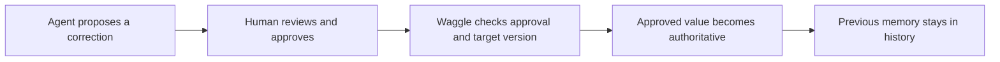

<!-- mcp-name: io.github.Abhigyan-Shekhar/Waggle-mcp -->

<p align="center">
  
</p>

<p align="center">
  <strong>Project memory for humans and AI agents.</strong><br/>
  Keep decisions, context, and the reasons behind them across conversations.
</p>

<p align="center">
  <a href="https://pypi.org/project/waggle-mcp"></a>
  
  
  
</p>

<p align="center">
  <a href="#quick-start">Install Waggle</a> ·
  <a href="https://waggle-webmcp.onrender.com/">Try the browser workspace</a> ·
  <a href="docs/install/README.md">Documentation</a>
</p>

---

## Keep the context, not just the conversation

Waggle is an open-source, local-first memory layer for AI agents. It stores
project knowledge as a graph: what you decided, why it matters, what it depends
on, and what has changed. Your next conversation can pick up from that context
instead of starting over.

Use Waggle with your MCP client, inspect and edit memory in Graph Studio, or
bring a portable memory graph into the browser workspace.

- **Continue across sessions.** Recall project decisions, requirements, preferences,
  and open questions without repeatedly pasting context.
- **Understand the reasoning.** Explore relationships, supporting evidence,
  contradictions, and the history behind a decision.
- **Keep control of corrections.** In the WebMCP workspace, agents propose changes;
  humans approve the exact content before it becomes authoritative.
- **Take memory with you.** Export and import `.abhi` files across supported
  workflows without tying your graph to one client.
- **Start locally.** The default SQLite store lives on your machine. Local use
  does not require a Waggle account or an external database.

## Quick Start

The Python package requires Python 3.11+ and `pipx`. On macOS, you can install
`pipx` with `brew install pipx`; see the [installation guide](docs/install/README.md)
for client-specific options.

```bash
pipx install waggle-mcp
pipx ensurepath
```

Restart your terminal after the first `pipx ensurepath`, then run:

```bash
waggle-mcp setup --yes
waggle-mcp doctor
```

Restart your MCP client to load Waggle. Setup detects supported clients and
writes their configuration; automatic memory behavior uses the client's
installed hooks, skills, or project instructions.

To check continuity, ask your agent to remember a project decision, then open
a fresh session in the same project and ask what was decided. Keep the same
project identifier across sessions.

### Choose your client

| Client | Setup guide |
|---|---|
| Codex | [Install the Waggle plugin or configure the MCP server](docs/install/codex.md) |
| Claude Code | [MCP server and automatic memory hooks](docs/install/claude-code.md) |
| Claude Desktop | [Desktop extension and manual configuration](docs/install/claude-desktop.md) |
| VS Code | [Waggle extension and workspace setup](docs/install/vscode.md) |
| Cursor | [Connect the local MCP server](docs/install/cursor.md) |
| Antigravity | [Client configuration](docs/install/antigravity.md) |
| Other MCP clients | [Standard MCP configuration](docs/install/generic-mcp.md) |
| ChatGPT with Site tools | [Use the browser workspace](#webmcp--memory-in-your-browser) |

For clients that accept an `mcpServers` configuration:

```json
{
  "mcpServers": {
    "waggle": {
      "command": "waggle-mcp",
      "args": ["serve", "--transport", "stdio"]
    }
  }
}
```

If the command is not found, run `pipx ensurepath` and reopen your terminal.
Use the [troubleshooting guide](docs/install/troubleshooting.md) for installation,
startup, and client connection issues.

## How memory works

Waggle separates durable project knowledge from the model's context window.
An agent retrieves relevant memory when needed and records meaningful outcomes
for later conversations.

1. **Capture:** record decisions, constraints, preferences, and supporting context.
2. **Connect:** link related memories and preserve contradictions and updates.
3. **Recall:** retrieve scoped context with evidence and provenance.
4. **Continue:** use that context in another session or supported client.

The core MCP workflow uses `prime_context` to load project context,
`query_graph` to retrieve relevant history, and `observe_conversation` to
record durable outcomes. `build_context` assembles a compact context pack for
a specific task. Tool availability alone does not make an agent use memory
automatically; its hooks, skills, or instructions must call these tools.

See the [tool reference](docs/reference.md) and
[configuration reference](docs/environment-variables.md) for the full API and
retrieval settings.

## Graph Studio

Graph Studio makes project memory inspectable and editable. Browse nodes and
relationships, add or remove graph content, inspect source evidence, and review
how a memory changed over time.

The browser workspace provides focused views for project context, memories,
proposals, and activity. Graph Studio provides the graph-level view of that
server-backed memory; private browser imports remain in the workspace tab.

**[Open Graph Studio](https://waggle-webmcp.onrender.com/graph)**

## WebMCP — memory in your browser

The [Waggle workspace](https://waggle-webmcp.onrender.com/) lets a human and a
compatible browser agent work with the same project memory. Its WebMCP adapter
registers page-level Site tools through `document.modelContext.registerTool`.
This is separate from installing Waggle's MCP server or configuring a remote
MCP connector.

### Connect and use the workspace

1. Open the workspace in ChatGPT's built-in browser using a model and account
   configuration that supports Site tools.
2. In the address bar, check **Site tools → Available site tools** and confirm
   the five Waggle tools are available. Keep this workspace tab open while
   working with its memory.
3. Explore the sample project or select **Load private .abhi** to work with your
   own graph.
4. Ask for a project brief or recall a specific decision. On the hosted workspace,
   use `project_id: waggle-webmcp`, including after importing your own graph.
5. To correct a memory, ask the agent to propose a replacement. Review it in
   **Proposals**, edit it if needed, and approve the exact value.
6. Ask the agent to apply the approved proposal using only its actual proposal
   ID. Recall the decision again to confirm the result and inspect its history.

For example:

```text
Call Waggle's get_project_brief with project_id "waggle-webmcp".
Use the returned memories to catch me up on this project.
```

If Site tools are unavailable, check the browser's permissions and configuration.
If the browser blocks an apply call, you can use **Apply approved change** on
the approved proposal and confirm the action yourself. This uses the same
approval and freshness checks; it does not bypass browser safeguards.

### Browser tools

| Tool | What it does |
|---|---|
| `get_project_brief` | Returns the project's goal, current decisions, constraints, state, and open questions. |
| `recall_memory` | Finds current authoritative memories for a query, with supersession provenance when available. |
| `propose_memory_change` | Creates a pending correction for human review without changing authoritative memory. |
| `apply_approved_memory_change` | Applies the exact approved value using only a proposal ID. |
| `load_abhi_for_session` | Loads a portable graph into this browser tab and returns a brief. |

### Corrections you can review



Approved content cannot be changed by the applying agent. If the target memory
has changed since the proposal was created, the proposal is marked stale
instead of overwriting newer information. Application preserves the previous
memory and links it to the replacement with an `updates` edge.

These approval rules govern the WebMCP correction workflow. They are not a
claim that every direct graph-editing or local MCP operation requires approval.

## Bring your own memory

A `.abhi` file is Waggle's portable memory graph. The browser importer reads
existing memories; it does not ingest a source repository to invent a project
brief.

1. Select **Load private .abhi** in the workspace.
2. Choose an unencrypted schema 2.x file, up to 700 KiB compressed and 4 MiB
   expanded.
3. Confirm the **Private session graph** indicator appears. Briefs, recall,
   proposals, and approvals now use that imported copy.

The import replaces this tab's active workspace; it does not merge with the
sample graph, modify your original file, or affect another visitor.

You can also attach the file to a compatible chat and ask:

```text
Use Waggle's load_abhi_for_session tool to load this .abhi file into
project "waggle-webmcp" for this session. Then call get_project_brief.
```

The agent must be able to read the attachment and provide its bytes as base64.
The tool does not accept a local file path or download URL. Use the page's file
picker if the chat cannot access the attachment.

See the [portable memory format](docs/abhi-format-v2.md) for archive structure
and supported operations.

## Your data and deployment options

| Where you use Waggle | Where memory lives |
|---|---|
| Local MCP server | SQLite on your machine, at `~/.waggle/waggle.db` by default. |
| Private browser import | This tab's `sessionStorage`; the importer does not upload the graph to Waggle's backend. |
| Hosted sample workspace | An isolated, temporary server-side sample project; not an account-based cloud backup. |
| Self-hosted remote MCP server | Your configured Neo4j backend and infrastructure. |

**Browser lifetime.** Private imports survive page reloads, and browser session
restoration can preserve them. Use the workspace's **Reset Demo** control to
explicitly clear the private copy and return to the sample project. Closing a
chat conversation alone is not a guaranteed deletion signal. Browser storage
is not encrypted by the importer.

**AI services.** Attaching a file in chat shares it with that chat provider.
Memory returned through tool calls is also shared with the requesting AI
service. Local storage does not mean that model inputs stay on your device.

**Hosted preview.** The public workspace is for trying the browser experience,
not durable production storage. Its free hosting can pause when idle, take time
to wake, and lose sample state on restart or redeployment. Opening it does not
connect to your local Waggle database. The included SQLite preview configuration
stores disposable state under `/tmp`, caps admission at 128 sessions per database,
and rejects new sessions at capacity without evicting existing ones.

**Self-hosting.** The browser preview's governance backend currently requires
SQLite. Remote MCP hosting with Neo4j is a separate configuration, not a drop-in
replacement for that browser workflow. For remote deployment, configure HTTPS,
authentication, persistent storage, and backups. Read the
[production deployment guide](docs/deployment/production.md),
[security model](docs/security/security-model.md), and
[hardening checklist](docs/security/hardening-checklist.md) before exposing a
server publicly.

## Development

Waggle uses Python for the memory engine and MCP server, and React/Vite for
Graph Studio and the browser workspace.

```bash
git clone https://github.com/Abhigyan-Shekhar/Waggle-mcp.git
cd Waggle-mcp
python -m venv .venv
source .venv/bin/activate
# Windows PowerShell: .venv\Scripts\Activate.ps1
python -m pip install -e ".[dev]"

WAGGLE_MODEL=deterministic pytest -q
ruff check src/ tests/
ruff format --check src/ tests/
```

On PowerShell, set `$env:WAGGLE_MODEL="deterministic"` before running `pytest -q`.
Deterministic embeddings keep tests offline; use the normal embedding model
when evaluating semantic retrieval.

For frontend changes:

```bash
npm ci --prefix apps/mcp/graph-ui
npm run test:unit --prefix apps/mcp/graph-ui
npm run build --prefix apps/mcp/graph-ui
```

## Documentation and contributing

- [Installation guides](docs/install/README.md)
- [Tool reference](docs/reference.md)
- [Configuration](docs/environment-variables.md)
- [Portable memory format](docs/abhi-format-v2.md)
- [Deployment and security](docs/deployment/production.md)
- [Contributing](CONTRIBUTING.md)
- [Repository map](docs/repository-map.md)
- [Report an issue](https://github.com/Abhigyan-Shekhar/Waggle-mcp/issues)

## License

Waggle is open source under the [Apache License 2.0](LICENSE).
